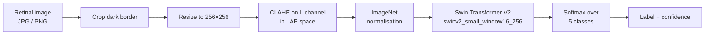

# Diabetic Retinopathy Detection

A web application that grades the severity of **diabetic retinopathy** from a retinal fundus
photograph, using a fine-tuned Swin Transformer V2 vision model.

Upload a retinal image, and the model returns one of five severity levels with a confidence
score and an explanation of what that stage means.

**CS 473 Graduation Project — Computer and Information Technology, Jubail Industrial College.
December 2025.**

> [!WARNING]
> **This is a student research project, not a medical device.** It has not been clinically
> validated, approved, or reviewed by any regulatory body, and its accuracy figures come from a
> held-out split of a public dataset — not from clinical trials. Nothing it outputs is a
> diagnosis. Screening for diabetic retinopathy must be done by a qualified ophthalmologist.

---

## Team

A four-person project, contributions split evenly (25% each).

| Member | |
|---|---|
| Saud Riyadh Alsayari | 431900784 |
| Majed Abdullah Almutairi | 431900585 |
| Abdullah Dhafer Alshehri | 431900855 |
| Abdurahman Saleh Alduraywish | 431900792 |

**Supervisor:** Dr. Turki Al Lelah

---

## Contents

- [How it works](#how-it-works)
- [Dataset and training](#dataset-and-training)
- [Results](#results)
- [Severity scale](#severity-scale)
- [Scope: what is built](#scope-what-is-built)
- [Project structure](#project-structure)
- [Running it locally](#running-it-locally)
- [API](#api)
- [Deployment](#deployment)
- [Tech stack](#tech-stack)

---

## How it works



### Preprocessing

Fundus photographs arrive with a large black border around the circular retina, and with wildly
inconsistent exposure between cameras and clinics. Three steps normalise that before the model
sees the image:

1. **Border crop** — pixels are thresholded against a grey tolerance and the image is cropped to
   the bounding box of what survives, removing the black surround so the retina fills the frame.
2. **Resize to 256×256** — matches the resolution the model was trained at.
3. **CLAHE** — the image is converted to LAB colour space and Contrast Limited Adaptive
   Histogram Equalisation (`clipLimit=3.0`, `tileGridSize=8×8`) is applied to the **L**
   (lightness) channel only, then converted back to RGB. Equalising lightness without touching
   the **a**/**b** colour channels lifts local contrast — making microaneurysms and haemorrhages
   more visible — without shifting the colour balance the model relies on.

The tensor is then normalised with the standard ImageNet mean and standard deviation.

### Model

A **Swin Transformer V2 Small** (`swinv2_small_window16_256`) loaded through
[`timm`](https://github.com/huggingface/pytorch-image-models), with the classifier head resized
to 5 classes and weights restored from a fine-tuned checkpoint. Swin V2 uses shifted-window
attention, so it captures both the fine local detail that early-stage lesions consist of and the
whole-retina context, at a fraction of the cost of full global attention.

Inference runs under `torch.no_grad()`, on CUDA when a GPU is present and on CPU otherwise.
Output logits pass through a softmax; the highest-probability class becomes the label and its
probability becomes the reported confidence.

---

## Dataset and training

Trained and validated on the public
[Kaggle Diabetic Retinopathy Detection](https://www.kaggle.com/c/diabetic-retinopathy-detection)
dataset, via transfer learning from pretrained SwinV2 weights.

Two problems dominated training:

- **Class imbalance.** The dataset is heavily skewed toward Stage 0 (No DR), which pushes a
  naively trained model toward always predicting the majority class. Addressed with **class
  weighting** in the loss so under-represented severity stages carry proportionally more weight.
- **Overfitting.** Managed with regularisation and cross-validation to check the model
  generalised rather than memorising the training split.

---

## Results

| Metric | Value |
|---|---|
| Training accuracy | ~97.6% |
| Validation accuracy | ~95.7% |

Measured on the Kaggle dataset split during development. Treat these as evidence the approach
works, not as clinical performance — accuracy on a curated public dataset does not transfer
directly to real screening conditions, and the gap between training and validation suggests some
residual overfitting.

---

## Severity scale

The model grades on the standard five-point international scale:

| Stage | Label | Description |
|:---:|---|---|
| 0 | **No DR** | No signs of disease; retina appears normal. |
| 1 | **Mild** | Presence of microaneurysms only. Vision is typically unaffected. |
| 2 | **Moderate** | Multiple microaneurysms, scattered intraretinal haemorrhages and/or soft exudates. |
| 3 | **Severe** | Extensive retinal haemorrhages or vascular blockage; features indicate imminent progression. |
| 4 | **Proliferative DR** | Formation of new abnormal blood vessels (neovascularisation); highest risk of vision loss. |

---

## Scope: what is built

This repository is the **working prototype**. The specification written for the course was
broader than what was implemented, so to be clear about where the line falls:

**Implemented and working**

- Full preprocessing pipeline — border crop, resize, CLAHE
- SwinV2 inference producing a 0–4 stage with a confidence score
- `POST /predict` REST endpoint
- Web client — drag-and-drop upload, 15 MB cap, image preview, severity slider, per-stage
  explanations, session history, light/dark theme
- Flask runtime serving both the API and the client

**Designed but not implemented**

- PostgreSQL persistence — schema designed (`patients`, `predictions`, `users`), not wired up
- JWT authentication and role management
- Clinician dashboard for multi-case review
- Grad-CAM heatmaps for visual explanation of predictions
- Cloud deployment, EHR integration (HL7/FHIR, DICOM)
- Automatic low-quality-image flagging and the "confidence < 70% → manual review" rule

---

## Project structure

```
.
├── backend/
│   ├── app.py             # Flask API — preprocessing, model loading, /predict
│   ├── requirements.txt   # CPU-only torch build, pinned
│   └── runtime.txt        # Python 3.10
└── frontend/
    ├── index.html         # Single-page client
    └── static/
        ├── app.js         # Upload, drag-and-drop, API call, result rendering
        └── styles.css     # Light/dark theme
```

The model was trained in a separate Jupyter notebook
(`diabetic_retinopathy_using_swin.ipynb`); this repository holds the inference service and
client. The trained checkpoint is downloaded at runtime rather than committed.

---

## Running it locally

**Requires:** Python 3.10

```bash
git clone https://github.com/iignlu/Graduation-Project.git
cd Graduation-Project/backend
python -m venv .venv && source .venv/bin/activate    # Windows: .venv\Scripts\activate
pip install -r requirements.txt
```

### Get the model checkpoint

`app.py` fetches `swinv2_small_window16_256_epoch_19.pt` from Google Drive on first start.

> [!NOTE]
> Google Drive serves an HTML confirmation page instead of the file for anything over ~100 MB,
> so a plain `requests.get` can silently save that page as the `.pt` and make `torch.load` fail.
> If that happens, download the checkpoint manually into `backend/`, or fetch it with a tool
> that handles the confirmation token:
> ```bash
> pip install gdown
> gdown 1h-DvV6gZIrxFMMnMM_UNLkBV00K5sBE- -O swinv2_small_window16_256_epoch_19.pt
> ```

### Start it

```bash
gunicorn app:app          # or: flask --app app run
```

Then open <http://localhost:8000>. The Flask app serves the client from `../frontend`, so the
whole thing runs from one process.

To point the client at a **remote** API instead, edit `PREDICT_URL` at the top of
`frontend/static/app.js`. CORS is enabled server-side, so the client can be hosted anywhere.

---

## API

### `POST /predict`

Multipart form upload.

| Field | Type | Required |
|---|---|:---:|
| `image` | file — JPG or PNG | yes |

**200 OK**

```json
{
  "class_id": 2,
  "label": "Moderate",
  "confidence": 0.87
}
```

**400 Bad Request** — no file under the `image` key:

```json
{ "error": "No image file provided" }
```

Example:

```bash
curl -F "image=@retina.jpg" http://localhost:8000/predict
```

---

## Deployment

The backend is a standard WSGI app with no `app.run()` call — the server is started by gunicorn,
which is what the platform invokes. `runtime.txt` pins Python 3.10, and `requirements.txt` pulls
the **CPU-only** torch wheels via PyTorch's extra index, which keeps the image small enough for
free hosting tiers and avoids shipping CUDA where there's no GPU.

> [!IMPORTANT]
> The previously deployed instance on Railway is **no longer running** — that host now returns
> `404 Application not found`. `PREDICT_URL` in `frontend/static/app.js` still points at it, so
> the hosted client cannot reach a backend until it is redeployed and that URL is updated.
> Running locally, as described above, works.

One thing to watch when redeploying: the checkpoint downloads at import time, so the first boot
is slow and the platform's health check may time out before the model finishes loading. Baking
the checkpoint into the image, or fetching it from object storage, avoids that.

---

## Tech stack

**Backend** — Python 3.10 · Flask · flask-cors · gunicorn
**Machine learning** — PyTorch · timm · Swin Transformer V2 Small · OpenCV · NumPy · Pillow
**Frontend** — HTML · CSS · JavaScript, no framework and no build step
**Tools** — Git · GitHub · VS Code · Jupyter
