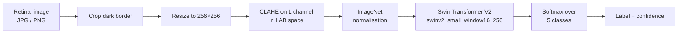

# Diabetic Retinopathy Detection

A web application that grades the severity of **diabetic retinopathy** from a retinal fundus
photograph, using a fine-tuned Swin Transformer V2 vision model.

Upload a retinal image, and the model returns one of five severity levels along with a
confidence score and an explanation of what that stage means.

**BSc Computer Science graduation project — Jubail Industrial College, 2026.**

> [!WARNING]
> **This is a student research project, not a medical device.** It has not been clinically
> validated, approved, or reviewed by any regulatory body. Nothing it outputs is a diagnosis.
> Never use it to make a decision about anyone's health — screening for diabetic retinopathy
> must be done by a qualified ophthalmologist.

---

## Contents

- [How it works](#how-it-works)
- [Severity scale](#severity-scale)
- [Project structure](#project-structure)
- [Running it locally](#running-it-locally)
- [API](#api)
- [Deployment](#deployment)
- [Tech stack](#tech-stack)

---

## How it works



### Preprocessing

Fundus photographs arrive with a large black border around the circular retina, and with wildly
inconsistent exposure between cameras and clinics. Three steps normalise that before the model
ever sees the image:

1. **Border crop** — pixels are thresholded against a grey tolerance and the image is cropped to
   the bounding box of what survives, removing the black surround so the retina fills the frame.
2. **Resize to 256×256** — matches the input resolution the model was trained at.
3. **CLAHE** — the image is converted to LAB colour space and Contrast Limited Adaptive
   Histogram Equalisation (`clipLimit=3.0`, `tileGridSize=8×8`) is applied to the **L**
   (lightness) channel only, then converted back to RGB. Equalising lightness without touching
   the **a**/**b** colour channels lifts local contrast — making microaneurysms and haemorrhages
   more visible — without shifting the colour balance the model relies on.

Finally the tensor is normalised with the standard ImageNet mean and standard deviation.

### Model

A **Swin Transformer V2 Small** (`swinv2_small_window16_256`) loaded through
[`timm`](https://github.com/huggingface/pytorch-image-models), with the classifier head resized
to 5 classes and weights restored from a fine-tuned checkpoint. Swin V2 uses shifted-window
attention, so it captures both the fine local detail that early-stage lesions consist of and the
whole-retina context, at a fraction of the cost of full global attention.

Inference runs under `torch.no_grad()`, on CUDA when a GPU is present and on CPU otherwise.
The output logits pass through a softmax; the highest-probability class becomes the label and
its probability becomes the reported confidence.

---

## Severity scale

The model grades on the standard five-point international scale:

| Level | Label | What it means |
|:---:|---|---|
| 0 | **No DR** | No abnormalities detected. Annual screening should continue. |
| 1 | **Mild** | Microaneurysms — small areas of swelling in retinal blood vessels. Vision is typically unaffected. |
| 2 | **Moderate** | More significant vessel damage that may lead to blockages. Warrants closer monitoring. |
| 3 | **Severe** | Many vessels blocked, starving areas of the retina of blood supply and triggering new vessel growth. |
| 4 | **Proliferative DR** | The most advanced stage. Fragile new vessels (neovascularisation) can bleed, risking severe vision loss. |

---

## Project structure

```
.
├── backend/
│   ├── app.py             # Flask API — preprocessing, model loading, /predict
│   ├── requirements.txt   # CPU-only torch build, pinned
│   └── runtime.txt        # Python 3.10
└── frontend/
    ├── index.html         # Single-page client
    └── static/
        ├── app.js         # Upload, drag-and-drop, API call, result rendering
        └── styles.css     # Light/dark theme
```

The client is a dependency-free single page: drag-and-drop or file-picker upload, a 15 MB size
cap, an image preview, a severity slider that highlights the predicted class, per-class
explanations, a session history of previous predictions, and a light/dark theme toggle.

---

## Running it locally

**Requires:** Python 3.10

```bash
git clone https://github.com/iignlu/Graduation-Project.git
cd Graduation-Project/backend
python -m venv .venv && source .venv/bin/activate    # Windows: .venv\Scripts\activate
pip install -r requirements.txt
```

### Get the model checkpoint

`app.py` fetches `swinv2_small_window16_256_epoch_19.pt` from Google Drive on first start.

> [!NOTE]
> Google Drive serves an HTML confirmation page instead of the file for anything over ~100 MB,
> so a plain `requests.get` can silently save that page as the `.pt` and make `torch.load` fail.
> If that happens, download the checkpoint manually into `backend/`, or fetch it with a tool
> that handles the confirmation token:
> ```bash
> pip install gdown
> gdown 1h-DvV6gZIrxFMMnMM_UNLkBV00K5sBE- -O swinv2_small_window16_256_epoch_19.pt
> ```

### Start it

```bash
gunicorn app:app          # or: flask --app app run
```

Then open <http://localhost:8000>. The Flask app serves the client from `../frontend`, so the
whole thing runs from one process.

To point the client at a **remote** API instead, edit `PREDICT_URL` at the top of
`frontend/static/app.js`. CORS is enabled server-side, so the client can be hosted anywhere.

---

## API

### `POST /predict`

Multipart form upload.

| Field | Type | Required |
|---|---|:---:|
| `image` | file — JPG or PNG | yes |

**200 OK**

```json
{
  "class_id": 2,
  "label": "Moderate",
  "confidence": 0.87
}
```

**400 Bad Request** — no file under the `image` key:

```json
{ "error": "No image file provided" }
```

Example:

```bash
curl -F "image=@retina.jpg" http://localhost:8000/predict
```

---

## Deployment

The backend is a standard WSGI app with no `app.run()` call — the server is started by gunicorn,
which is what the platform invokes. `runtime.txt` pins Python 3.10, and `requirements.txt` pulls
the **CPU-only** torch wheels via PyTorch's extra index, which keeps the image small enough for
free hosting tiers and avoids shipping CUDA where there's no GPU.

> [!IMPORTANT]
> The previously deployed instance on Railway is **no longer running** — that host now returns
> `404 Application not found`. `PREDICT_URL` in `frontend/static/app.js` still points at it, so
> the hosted client cannot reach a backend until it is redeployed and that URL is updated.
> Running locally, as described above, works.

One thing to watch when redeploying: the checkpoint downloads at import time, so the first boot
is slow and the platform's health check may time out before the model finishes loading. Baking
the checkpoint into the image, or fetching it from object storage, avoids that.

---

## Tech stack

**Backend** — Python · Flask · flask-cors · PyTorch · timm · OpenCV · NumPy · Pillow · gunicorn
**Model** — Swin Transformer V2 Small (`swinv2_small_window16_256`), 5-class fine-tune
**Frontend** — HTML · CSS · JavaScript, no framework and no build step

---

## Author

**Abdullah Alshehri** — BSc Computer Science, Jubail Industrial College

[aalshehri.site](https://aalshehri.site) ·
[LinkedIn](https://www.linkedin.com/in/abdullah-alshehri-596658250/) ·
[GitHub](https://github.com/iignlu)
